<div align="center">

# Tatvam
**AI-First Adaptive Learning Companion**

[](https://opensource.org/licenses/MIT)
[](https://www.typescriptlang.org/)
[](https://nextjs.org/)
[](https://expressjs.com/)
[](https://www.prisma.io/)
[](https://www.postgresql.org/)
[](https://tailwindcss.com/)
[](https://deepmind.google/technologies/gemini/)
[]()

*Transforming education from static consumption to dynamic, personalized comprehension.*

[Explore the Vision](#vision) • [Core Philosophy](#core-philosophy) • [Architecture](#high-level-architecture) • [Feature Matrix](#complete-feature-matrix)

</div>

---

## 1. Project Introduction

Welcome to **Tatvam**—an advanced, AI-first adaptive learning companion. Designed to solve the systemic flaws of modern mass education, Tatvam moves beyond one-size-fits-all curricula by tailoring the entire learning journey to the individual student's cognitive profile, pacing, and preferred language. Tatvam ingests static educational material (PDFs, lectures, notes) and transforms it into an interactive, semantic knowledge graph. Through highly contextual RAG (Retrieval-Augmented Generation) pipelines, an active AI Mentor, and on-demand micro-learning resources, Tatvam ensures that mastery replaces mere memorization.

---

## 2. Core Identity

### Vision
To democratize true comprehension by providing every student on earth with a deeply personalized, infinitely patient, and hyper-intelligent AI tutor that speaks their language and adapts to their unique cognitive fingerprint.

### Mission
To build the most sophisticated, accessible, and adaptive learning engine that bridges the gap between passive consumption and active mastery, empowering learners to conquer complex concepts regardless of their background or learning disabilities.

### Educational Problem Statement
Traditional education models suffer from fundamental scalability limits:
1. **The 2 Sigma Problem:** One-to-one tutoring yields massive improvements (2 standard deviations), but is economically unscalable.
2. **Standardized Pacing:** Classrooms move at the speed of the average student, leaving advanced learners bored and struggling learners behind.
3. **Passive Consumption:** Students read textbooks and watch videos, leading to the "illusion of competence" rather than genuine retention.
4. **Language Barriers:** Complex technical concepts are often locked behind English proficiency, alienating ESL and vernacular learners.

### Why Tatvam Exists
Tatvam exists to dissolve these barriers. By leveraging state-of-the-art Large Language Models, high-dimensional vector embeddings, and robust educational psychology (Active Recall, Spaced Repetition, Cognitive Load Theory), Tatvam scales the one-to-one tutoring experience to infinity.

### Core Philosophy
- **Understanding over Memorization:** We test the *application* of concepts, not the recitation of facts.
- **Dynamic over Static:** No two students receive the same explanation.
- **Empathetic AI:** The AI Mentor detects frustration, adjusts its pedagogical strategy, and provides emotional scaffolding.

### Product Principles
1. **AI-Native:** AI is not a bolted-on feature; it is the core routing and rendering engine of the platform.
2. **Frictionless Ingestion:** If a student can read it, Tatvam can ingest, chunk, and teach it.
3. **Absolute Privacy:** User knowledge graphs and learning DNA are securely isolated.

### Target Audience
- **K-12 & University Students:** Seeking to master dense curricula.
- **Self-Taught Professionals:** Upskilling through dense technical documentation.
- **Neurodivergent Learners:** Requiring specific pacing, visual aids, or alternative explanation models.
- **ESL/Vernacular Learners:** Needing native-language scaffolding for complex concepts.

---

## 3. Architecture & System Workflows

### 3.1 Overall System Architecture

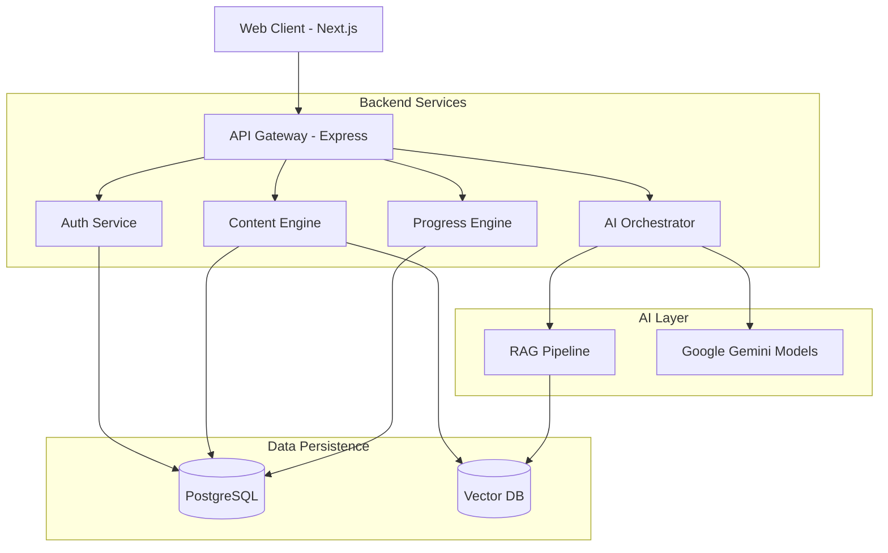

### 3.2 Authentication Flow

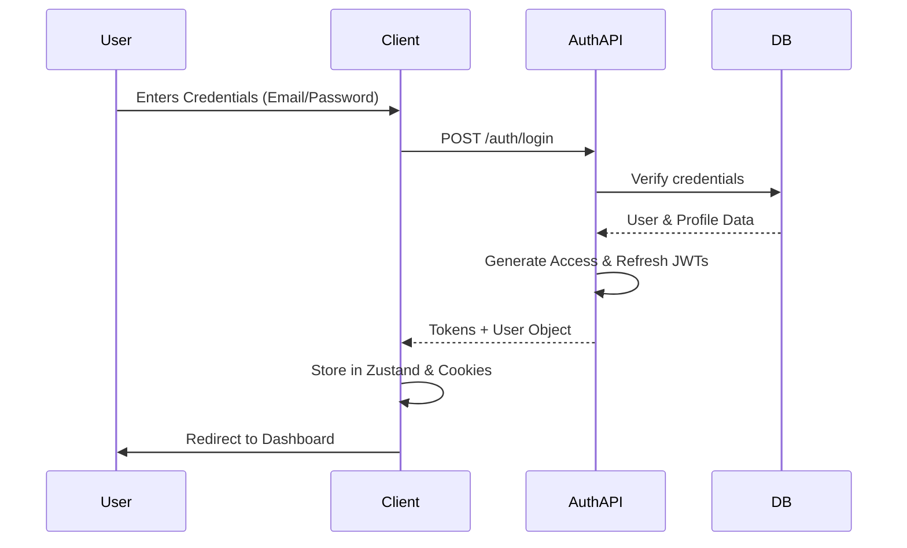

### 3.3 Document Upload Pipeline

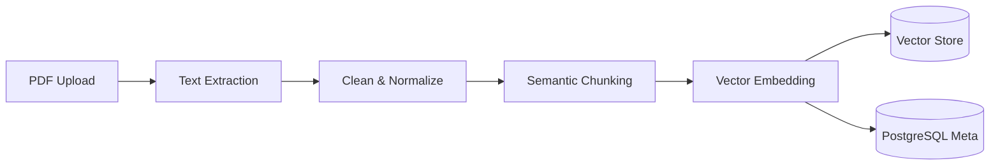

### 3.4 Knowledge Extraction Pipeline

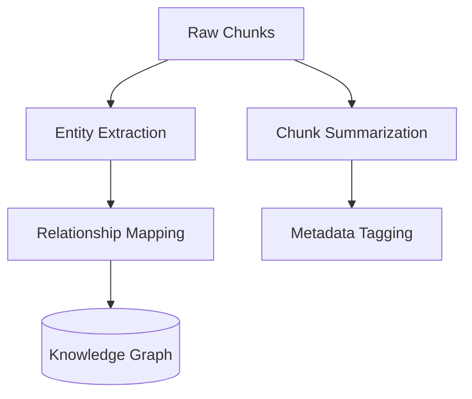

### 3.5 Semantic Chunking

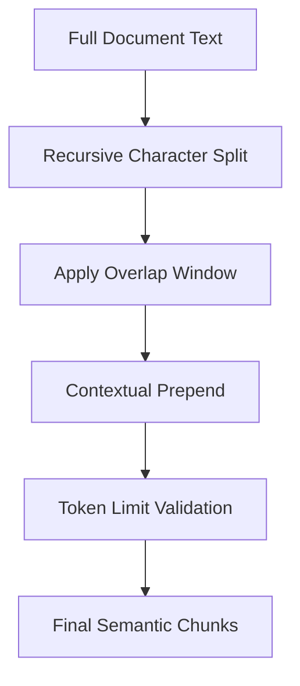

### 3.6 Embedding Flow

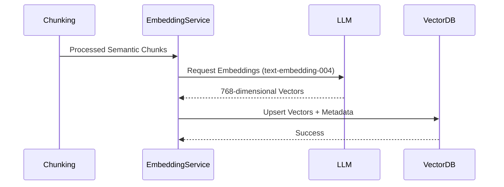

### 3.7 RAG Flow (Retrieval-Augmented Generation)

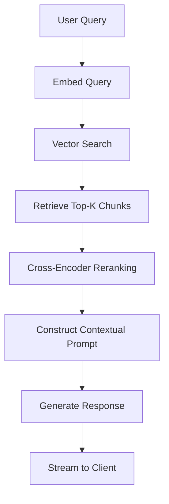

### 3.8 AI Mentor Workflow

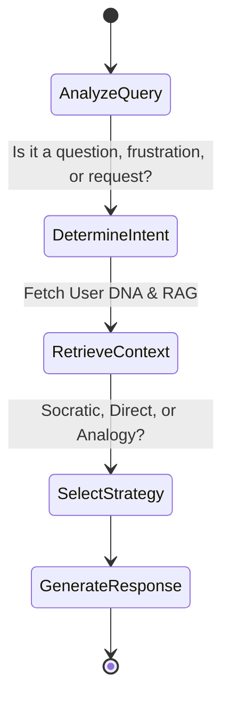

### 3.9 Adaptive Learning Cycle

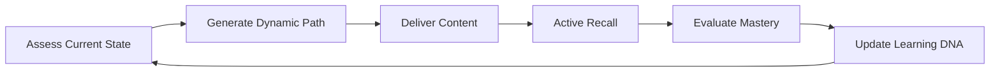

### 3.10 Resource Generation Pipeline

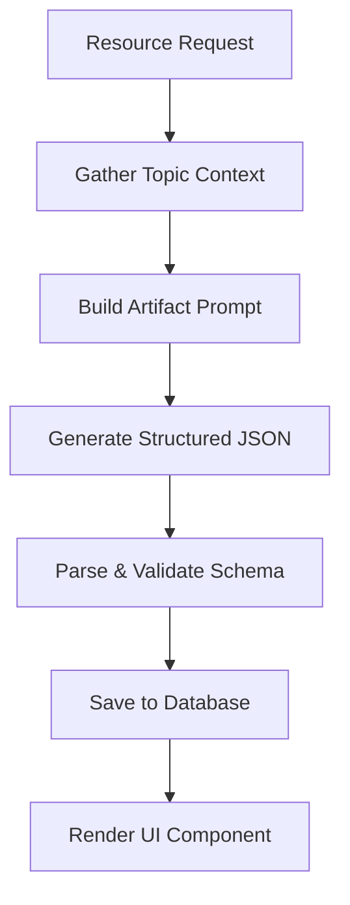

### 3.11 Learning Progress Lifecycle

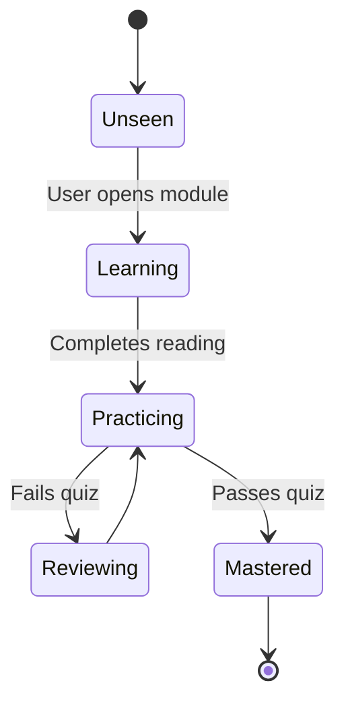

### 3.12 User Journey

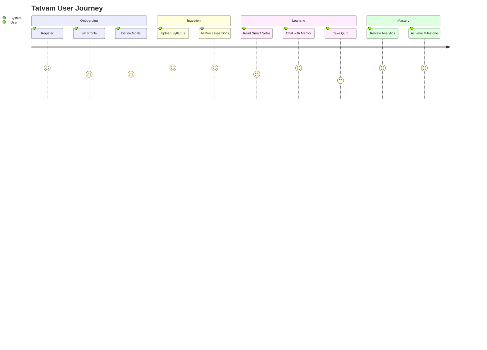

### 3.13 Multilingual Processing

```mermaid
graph TD
    Req[User Request] --> Interceptor[Attach X-Preferred-Language]
    Interceptor --> Controller[Extract Language]
    Controller --> Service[Inject System Prompt Constraint]
    Service --> LLM[Native Generation (No Post-Translation)]
    LLM --> UI[Client Renders in Preferred Language]
```

### 3.14 Application Architecture

```mermaid
graph TD
    subgraph Frontend (Next.js)
        UI[React Components]
        State[Zustand Stores]
        Cache[React Query]
    end
    subgraph Backend (Express)
        Routes[API Routes]
        UseCases[Business Logic]
        Services[External Integrations]
    end
    subgraph Data
        Prisma[ORM Layer]
        PG[(Postgres)]
    end
    UI <--> State
    State <--> Cache
    Cache <--> Routes
    Routes <--> UseCases
    UseCases <--> Services
    UseCases <--> Prisma
    Prisma <--> PG
```

### 3.15 Database Relationships (High Level)

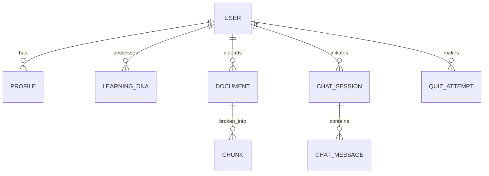

---

## 4. Key Differentiators

| Traditional EdTech | Tatvam AI |
| :--- | :--- |
| **Static Content:** PDFs and pre-recorded videos. | **Dynamic Content:** Real-time generation of notes, flashcards, and quizzes based on exact user context. |
| **Fixed Pacing:** Everyone follows the same syllabus. | **Adaptive Pacing:** The system slows down for complex topics and accelerates through mastered ones. |
| **Generic Explanations:** Textbook definitions. | **Tailored Explanations:** Analogies mapped to the user's specific interests (e.g., explaining Physics using football). |
| **Monolingual:** Forced to learn in English. | **Native Multilingual:** Seamless real-time instruction and UI mapping in the user's native tongue. |
| **Passive Consumption:** Reading and highlighting. | **Active Recall:** Continuous Socratic questioning and low-stakes assessments. |

---

## 5. Complete Feature Matrix

| Category | Feature | Status | Description |
| :--- | :--- | :--- | :--- |
| **Core** | Document Upload | Implemented | PDF/Text ingestion with background extraction. |
| **Core** | RAG Engine | Implemented | Vector-based semantic search for contextual grounding. |
| **Core** | Multilingual Pipeline | Implemented | 100% native language generation and UI adaptation. |
| **AI** | AI Mentor | Implemented | Streaming chat interface with pedagogical strategies. |
| **AI** | Smart Notes | Implemented | AI-generated structured summaries from documents. |
| **AI** | Flashcard Gen | Implemented | Automated spaced-repetition deck creation. |
| **AI** | Quiz Generation | Implemented | Dynamic multiple-choice questions based on context. |
| **Learning** | Learning DNA | Vision | Deep cognitive profiling to dictate AI tone and strategy. |
| **Learning** | Spaced Repetition | Vision | Algorithmic scheduling of reviews for long-term retention. |
| **Learning** | Knowledge Graph | Vision | Visual node-based representation of user mastery. |
| **User** | Authentication | Implemented | Secure JWT-based registration, login, and sessions. |
| **User** | Profile & Settings | Implemented | Configurable themes, languages, and notifications. |
| **Platform** | Accessibility | Vision | Screen-reader optimized, high-contrast, and keyboard navigation. |

---

## 6. Comprehensive Feature Documentation

*(Note: Features marked **[Implemented]** are currently live in the codebase. Features marked **[Vision]** represent the planned roadmap.)*

### 6.1 Authentication & Security [Implemented]
- **Purpose:** Securely identify users and protect their learning data.
- **How it works:** Utilizes JWT (Access & Refresh tokens) via an Express backend, stored securely on the frontend. Includes OTP validation and password hashing (Bcrypt).
- **Benefits:** Seamless sessions without constant re-login; isolated tenant data.
- **Student Experience:** A frictionless, beautiful login screen that remembers them safely.
- **Technical Workflow:** `Client -> API -> Prisma -> DB`. Tokens are stored in HttpOnly cookies/Zustand.

### 6.2 Settings & User Profile [Implemented]
- **Purpose:** Allow users to dictate their platform experience.
- **How it works:** Users can configure Notification preferences, Theme (Light/Dark), and deeply integrated Language Preferences.
- **Benefits:** A comfortable, tailored environment.
- **Technical Workflow:** React Query mutations ping the `/auth/profile` endpoint, updating the PostgreSQL `Profile` table. Zustand state updates trigger instantaneous DOM repaints.

### 6.3 Multilingual Learning Pipeline [Implemented]
- **Purpose:** Break down language barriers in technical education.
- **How it works:** Users select a Preferred Language (e.g., Gujarati, Hindi). The API client injects `X-Preferred-Language` headers into all requests. The backend AI orchestrator prepends strict language generation constraints to the LLM system prompt.
- **Benefits:** True localized comprehension without clunky post-translation artifacts.
- **Student Experience:** A user clicks "Hindi", and instantly, the AI mentor and generated study resources flip to native Hindi.

### 6.4 Document Upload & Viewer [Implemented]
- **Purpose:** Bring external knowledge into the Tatvam ecosystem.
- **How it works:** Users upload PDFs. The backend orchestrates text extraction (via `pdf-parse`), semantic chunking, and metadata tagging. The frontend utilizes `react-pdf` for a custom, synchronized reading experience.
- **Benefits:** Converts dead text into an interactive learning environment.
- **Technical Workflow:** Multer intercept -> File storage -> Background worker -> Text Splitter -> Vector DB.

### 6.5 AI Mentor (Socratic Chat) [Implemented]
- **Purpose:** Provide an infinitely patient, 24/7 personal tutor.
- **How it works:** A chat interface utilizing Server-Sent Events (SSE) for streaming text. The backend retrieves the user's RAG context, current lesson, and pedagogical strategy, passing it to Gemini models.
- **Benefits:** Immediate unblocking of confused students.
- **Student Experience:** "I don't understand thermodynamics." -> AI Mentor: "Let's break it down. Have you ever noticed how a hot cup of tea cools down?"

### 6.6 Knowledge Extraction (Smart Notes & Flashcards) [Implemented]
- **Purpose:** Automate the tedious process of resource creation.
- **How it works:** The user selects a topic. The system performs a similarity search over their uploaded documents and prompts the LLM to output a strict JSON schema representing structured notes or flashcards.
- **Benefits:** Saves hundreds of hours of manual summarization.
- **Technical Workflow:** `Query -> Embed -> Vector Search -> Prompt Formulation -> LLM JSON -> Client Render`.

### 6.7 Assessments & Practice [Implemented]
- **Purpose:** Implement Active Recall to solidify memory.
- **How it works:** Dynamically generated quizzes based on the exact semantic chunks the user just read. Tracks score and updates a basic progress model.
- **Benefits:** Forces the brain to retrieve information, strengthening neural pathways.

### 6.8 Learning DNA [Vision]
- **Purpose:** Map the cognitive profile of the user.
- **How it works:** By analyzing quiz results, time-on-page, and chat interactions, the system builds a vector representing the user's ideal pacing, visual preference, and frustration threshold.
- **Benefits:** The ultimate personalization engine.

### 6.9 Knowledge Graph [Vision]
- **Purpose:** Visually represent mastery.
- **How it works:** Extracts semantic concepts from documents and links them as nodes. As students pass quizzes, nodes turn from red to green.

---

## 7. Technology Stack

| Layer | Technology | Purpose |
| :--- | :--- | :--- |
| **Frontend Framework** | Next.js 14 (React) | SSR, Routing, and high-performance UI rendering. |
| **Styling** | Tailwind CSS | Utility-first, responsive, and maintainable styling. |
| **State Management** | Zustand | Lightweight, hook-based global state for complex interactions. |
| **Data Fetching** | React Query | Caching, synchronization, and optimistic UI updates. |
| **Backend Server** | Node.js + Express | Robust, scalable REST API layer. |
| **Database ORM** | Prisma | Type-safe database access and schema management. |
| **Relational Database**| PostgreSQL | Core persistence for users, profiles, and metadata. |
| **AI Models** | Google Gemini | High-speed, context-heavy reasoning and generation. |
| **Vector Search** | (Integrated RAG) | High-dimensional semantic similarity matching. |

---

## 8. High-Level Folder Structure

```text
Tatvam/
├── frontend/                     # Next.js Client
│   ├── src/
│   │   ├── app/                  # App Router (Pages & Layouts)
│   │   ├── components/           # Reusable UI Blocks (Auth, Dashboard, Layout)
│   │   ├── hooks/                # Custom React Hooks
│   │   ├── lib/                  # Utilities (api-client, formatters)
│   │   ├── store/                # Zustand Stores (auth, engine, notifications)
│   │   └── config/               # Routing and Environment Constants
│   ├── public/                   # Static Assets (Images, Logos)
│   └── package.json              # Frontend Dependencies
│
├── backend/                      # Node/Express API
│   ├── src/
│   │   ├── api/                  # Controllers & Routes (auth, ai, content)
│   │   ├── core/                 # Business Logic & Services (AIService, AuthService)
│   │   ├── config/               # Environment & Database connections
│   │   ├── events/               # Domain Event Bus
│   │   ├── di/                   # Dependency Injection Container
│   │   └── utils/                # Helpers (JWT, Hash, Validators)
│   ├── prisma/                   # Database Schema & Migrations
│   └── package.json              # Backend Dependencies
│
└── README.md                     # You are here
```

---

## 9. Screenshots

### Dashboard

*A centralized view of daily progress, active modules, and quick actions.*

### Knowledge Workspace

*A split-pane environment featuring the document viewer on the left and the AI Mentor on the right.*

### AI Mentor Chat

*Streaming native-language responses tailored to the user's specific query.*

### Settings & Localization

*Deep configuration allowing immediate application-wide language shifts.*

---

## 10. Security & Performance

### Privacy & Security
- **Data Isolation:** All vector embeddings and semantic chunks are strictly tied to `ownerId`.
- **Stateless Auth:** JWTs prevent session hijacking and scale infinitely across backend instances.
- **Prompt Injection Defense:** System instructions are aggressively locked to prevent malicious manipulation of the AI Mentor.

### Performance & Scalability
- **Streaming LLM Responses:** SSE ensures zero perceived latency during heavy generation tasks.
- **Optimistic UI:** React Query instantly updates the DOM while backend mutations resolve silently.
- **Connection Pooling:** Prisma seamlessly manages highly concurrent connections to PostgreSQL.

---

## 11. Contribution Guide & Future Roadmap

### Roadmap Highlights
- [ ] **Phase 1 (Current):** Foundational Auth, RAG Pipeline, and Socratic AI Mentor.
- [ ] **Phase 2 (Upcoming):** Full dynamic Knowledge Graph visualization.
- [ ] **Phase 3 (Vision):** Real-time Spaced Repetition algorithms integrated into daily emails.
- [ ] **Phase 4 (Vision):** Collaborative study groups with shared AI contexts.

### How to Contribute
1. Fork the repository.
2. Create a feature branch (`git checkout -b feature/amazing-feature`).
3. Ensure all TypeScript strict checks pass.
4. Submit a Pull Request detailing the architectural changes and UI impact.

---

## 12. FAQ

**Q: Does Tatvam just give students the answers?**
A: No. Tatvam's prompt engineering strictly enforces a Socratic method. It guides the student to the answer, forcing active cognitive engagement.

**Q: How does the Multilingual system work without a translation library?**
A: We bypass traditional i18n JSON files for content generation. The LLM natively generates its entire output in the requested language, preserving nuance and context better than standard translation layers. 

**Q: Is my data used to train the models?**
A: No. We utilize enterprise API endpoints where data retention for model training is strictly disabled.

---

## 13. Credits & License

**Developed for the Maverick Effect AI Challenge 2026.**

This project is licensed under the MIT License - see the LICENSE file for details.

---
<div align="center">
    <i>Tatvam — The essence of learning.</i>
</div>
