<div align="center">

# Tatvam
**AI-First Adaptive Learning Companion**

[](#14-license)
[](https://www.typescriptlang.org/)
[](https://nextjs.org/)
[](https://expressjs.com/)
[](https://www.prisma.io/)
[](https://www.postgresql.org/)
[](https://tailwindcss.com/)
[](https://deepmind.google/technologies/gemini/)
[](#)

*Transforming education from static consumption to dynamic, personalized comprehension.*

</div>

---

## Executive Summary

**What is Tatvam?**  
Tatvam is a highly sophisticated, AI-driven adaptive learning engine. It ingests static educational content (PDFs, lectures, notes) and transforms it into an interactive, multilingual, and dynamic semantic knowledge graph. 

**Why does it exist?**  
To solve the "2 Sigma Problem" at scale. One-to-one tutoring is mathematically proven to dramatically increase student comprehension, yet it remains economically unscalable. Tatvam brings infinite, personalized tutoring to every student.

**What problem does it solve?**  
Modern education relies on passive consumption and standardized pacing. Students read textbooks and assume competence without testing application. Furthermore, complex technical concepts are often gatekept by English proficiency. Tatvam enforces active recall, adapts to individual pacing, and translates concepts seamlessly into native languages.

**Who is it for?**  
K-12 students, university scholars, self-taught professionals, neurodivergent learners needing alternative pedagogical strategies, and ESL learners facing language barriers in technical subjects.

**Why is it different?**  
Instead of serving as a generic "wrapper" around an LLM, Tatvam is built on a deterministic AI Orchestration Layer. It uses highly contextual Retrieval-Augmented Generation (RAG) tied to semantic chunking, ensuring the AI Mentor only teaches what is actually in the curriculum, adapting its tone and strategy based on the student's evolving cognitive profile.

---

## 1. Why Tatvam?

Education technology historically focuses on digitizing the classroom rather than optimizing the mind. Modern education struggles because it treats all brains as identical processing units. When a classroom moves at the speed of the average student, advanced learners disengage, and struggling learners compound their knowledge gaps.

Existing learning platforms are insufficient because they prioritize *content delivery* over *content comprehension*. Watching a video or highlighting a PDF provides the illusion of competence. True mastery requires Socratic friction—being forced to retrieve information, apply it, and explain it.

Furthermore, AI in education is dangerously veering toward simply "generating answers" for students. Tatvam takes the opposite approach. AI should not do the thinking for the student; it should scaffold the environment so the student is forced to think efficiently. Tatvam exists to enforce understanding over memorization through rigorous educational philosophy applied via deterministic AI architecture.

---

## 2. Learning Philosophy

Tatvam is engineered around proven cognitive science principles.

- **Understanding > Memorization:** The system refuses to provide direct answers to homework questions. Instead, it tests the *application* of concepts, ensuring semantic understanding.
- **Active Recall:** Through dynamically generated quizzes and conversational AI prompts, Tatvam forces the brain to actively retrieve information, strengthening neural pathways.
- **Socratic Learning:** The AI Mentor utilizes Socratic questioning, guiding the student to their own epiphanies through carefully structured analogies and hints.
- **Adaptive Learning:** The platform identifies knowledge gaps in real-time, slowing down the pacing for difficult subjects and accelerating through mastered content.
- **Contextual AI:** AI generations are strictly bounded by the semantic context of the uploaded syllabus. It does not hallucinate external facts; it teaches the provided material.
- **Learning DNA (Vision):** The continuous mapping of a student's cognitive profile—tracking their ideal pacing, visual preference, and frustration thresholds to dictate future AI interactions.
- **Knowledge Graph (Vision):** A visual, node-based representation of user mastery, showing precisely how individual concepts interconnect.
- **Spaced Repetition (Vision):** Algorithmic scheduling of reviews to interrupt the Ebbinghaus forgetting curve, ensuring long-term retention.

---

## 3. Inside Tatvam: The Learning Lifecycle

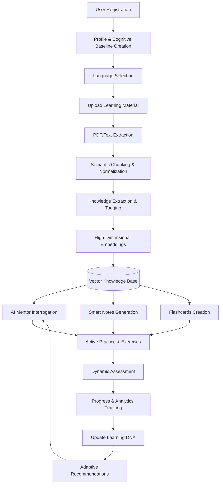

---

## 4. Core Product Modules

| Module | Purpose | Implementation Status | Examples |
| :--- | :--- | :--- | :--- |
| **Authentication** | Secure identity and session management. | Implemented | JWT, bcrypt, OTP flows. |
| **Dashboard** | Centralized analytics and quick actions. | Implemented | Progress rings, recent lessons. |
| **Knowledge Engine** | Ingestion and semantic vectorization of documents. | Implemented | PDF parsing, chunking, PGVector. |
| **AI Mentor** | Socratic, context-aware 24/7 personal tutor. | Implemented | Streaming SSE chat interface. |
| **Learning Engine** | Content delivery and pacing. | Implemented | Interactive document viewer. |
| **Resource Generator** | Automated creation of study materials. | Implemented | Smart notes, Flashcards. |
| **Practice Engine** | Active recall reinforcement. | Implemented | On-demand exercise generation. |
| **Assessment Engine** | Formal mastery evaluation. | Implemented | Dynamic multiple-choice quizzes. |
| **Analytics** | Tracking time, scores, and mastery. | Implemented | Historical session tracking. |
| **Profile** | User identity and personalization. | Implemented | Avatars, bios, baseline DNA. |
| **Settings** | Application-wide configuration. | Implemented | Theme, Notifications. |
| **Multilingual Engine** | Native language comprehension bridging. | Implemented | Instant UI & AI translation. |
| **Security** | Ensuring data isolation and privacy. | Implemented | Zod validation, Owner ID checks. |

---

## 5. Architecture & System Workflows

### 5.1 Overall System Architecture

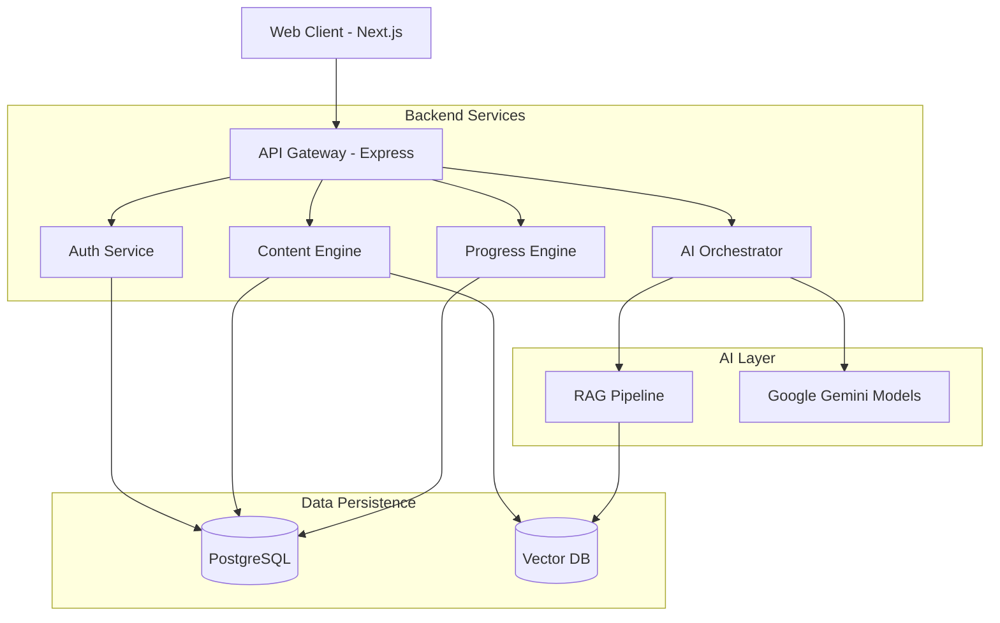

### 5.2 Authentication Flow

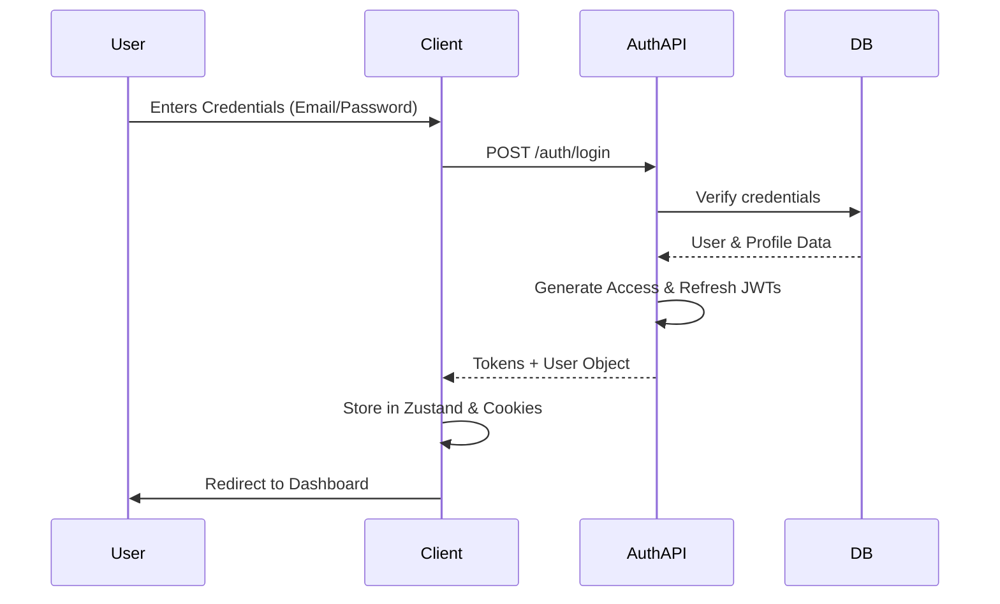

### 5.3 Document Upload Pipeline

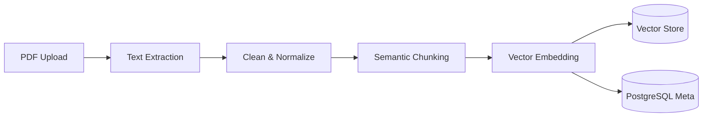

### 5.4 Knowledge Extraction Pipeline

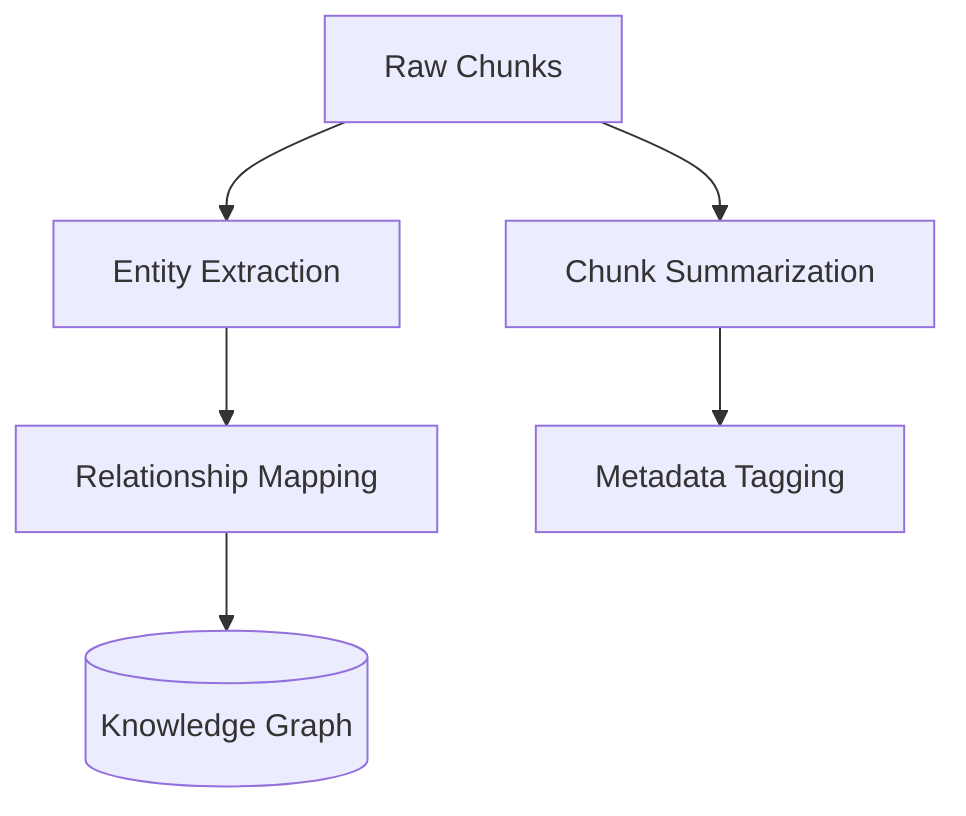

### 5.5 Semantic Chunking

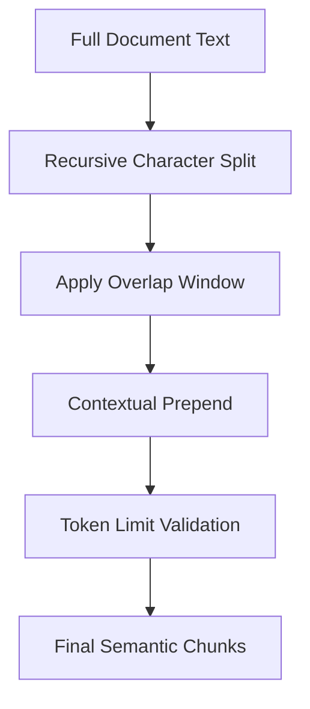

### 5.6 Embedding Flow

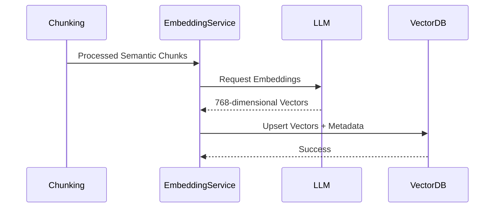

### 5.7 RAG Flow (Retrieval-Augmented Generation)

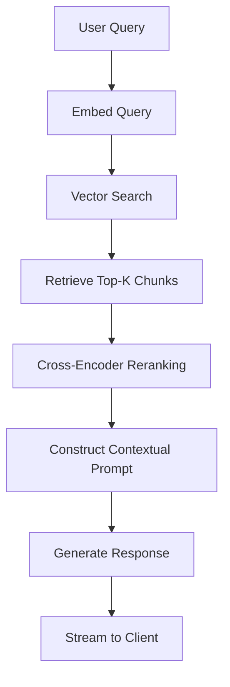

### 5.8 AI Mentor Workflow

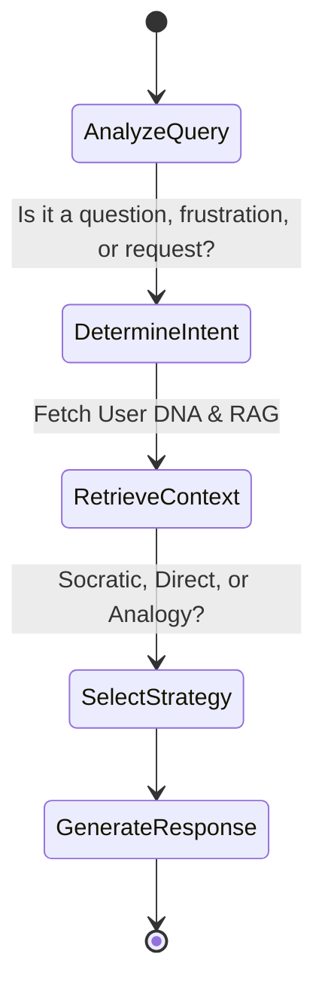

### 5.9 Adaptive Learning Cycle

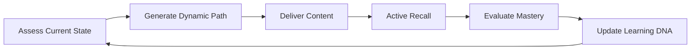

### 5.10 Resource Generation Pipeline

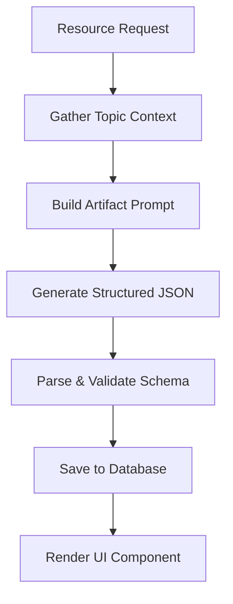

### 5.11 Learning Progress Lifecycle

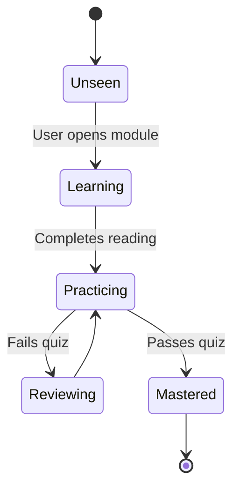

### 5.12 User Journey

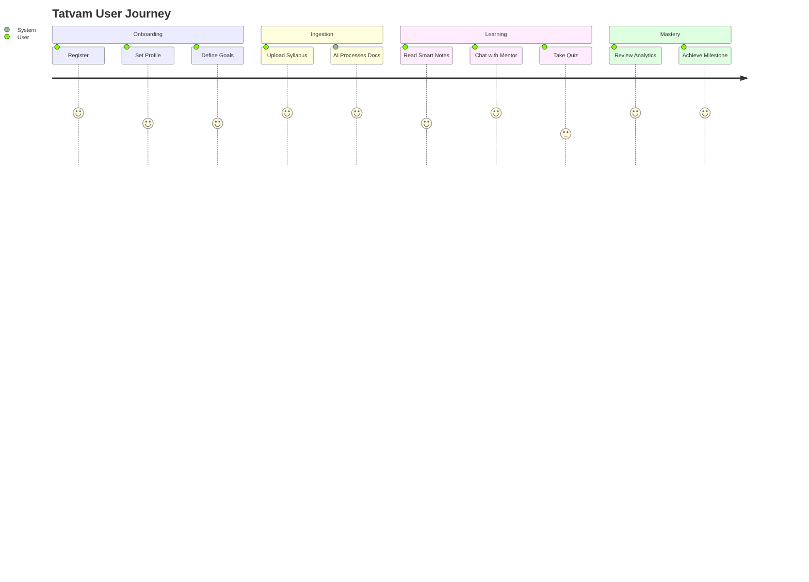

### 5.13 Multilingual Processing

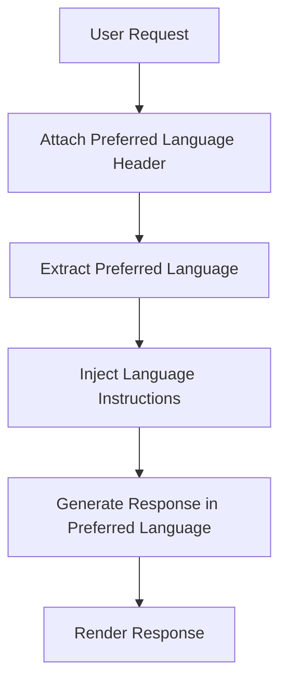

### 5.14 Application Architecture

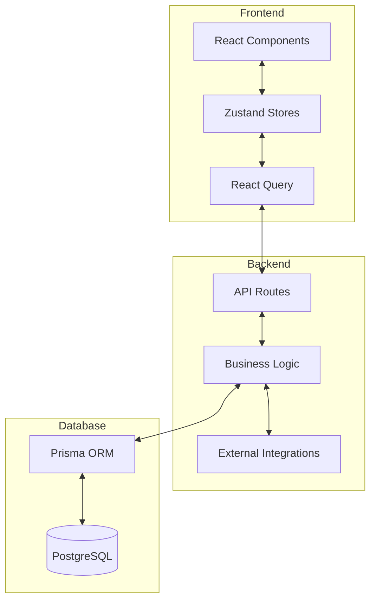

### 5.15 Database Relationships (High Level)

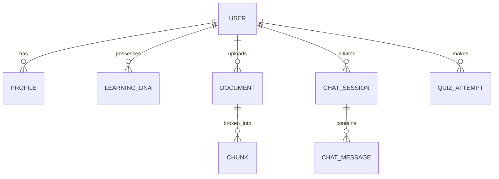

---

## 6. AI Architecture

Tatvam does not blindly forward API requests to LLMs. It utilizes a robust, deterministic **AI Orchestration Layer** designed for educational safety and factual grounding.

### The AI Orchestrator
Acts as the central nervous system, intercepting all user requests, analyzing intent, and constructing highly constrained prompts before reaching out to any model. 

### Provider Manager & Model Selection
Tatvam features a dynamic provider registry.
- **Implemented:** **Google Gemini** acts as the primary generative engine due to its exceptional speed, massive context window, and robust JSON structuring capabilities.
- **Extensible Architecture:** The Provider Manager is explicitly designed to failover or route to alternative models (e.g., OpenAI GPT, xAI Grok) via a unified interface. These models can be seamlessly registered in the backend as the platform scales.

### Embedding Model
Documents are converted into 768-dimensional vectors using specialized embedding models, ensuring that semantic similarity searches for RAG operate at the highest possible accuracy.

### Secure Prompt Engineering & Context Injection
Every AI request passes through a context compiler that injects:
1. The extracted semantic chunks (Grounding).
2. The user's Learning DNA and preferred language.
3. Strict pedagogical constraints (e.g., "Do not give the direct answer; use the Socratic method").

### Streaming & Response Validation
Responses from the AI Mentor are streamed to the client using Server-Sent Events (SSE) for zero-perceived latency. Background resource generation (notes, quizzes) utilizes strict schema validation (Zod) to ensure the AI's output exactly matches the database's expected JSON format.

---

## 7. Technology Stack

| Layer | Technology | Purpose | Implementation Status |
| :--- | :--- | :--- | :--- |
| **Frontend** | Next.js 14, React, Tailwind CSS | High-performance, SSR UI rendering. | Implemented |
| **State & Cache**| Zustand, React Query | Global state and optimistic data synchronization. | Implemented |
| **Backend API** | Node.js, Express | Scalable REST API and SSE streaming layer. | Implemented |
| **Database** | PostgreSQL, Prisma ORM | Relational data integrity and schema management. | Implemented |
| **Primary AI** | Google Gemini | High-speed, context-heavy reasoning and generation. | Implemented |
| **Alt AI Providers**| OpenAI, xAI Grok | Fallback/Specialized reasoning models. | Extensible Architecture |
| **Embedding Layer**| text-embedding models | High-dimensional semantic similarity matching. | Implemented |
| **AI Orchestrator**| Custom Provider Registry | Model routing, failover, and context injection. | Implemented |

---

## 8. Comprehensive Feature Documentation

*(Note: Features marked **[Implemented]** are currently live in the codebase. Features marked **[Vision]** represent the planned roadmap.)*

### 8.1 Authentication & Security [Implemented]
- **Purpose:** Securely identify users and protect their learning data.
- **How it works:** Utilizes JWT (Access & Refresh tokens) via an Express backend, stored securely on the frontend. Includes OTP validation and password hashing (Bcrypt).
- **Benefits:** Seamless sessions without constant re-login; isolated tenant data.
- **Student Experience:** A frictionless, beautiful login screen that remembers them safely.
- **Technical Workflow:** `Client -> API -> Prisma -> DB`. Tokens are stored in HttpOnly cookies/Zustand.

### 8.2 Settings & User Profile [Implemented]
- **Purpose:** Allow users to dictate their platform experience.
- **How it works:** Users can configure Notification preferences, Theme (Light/Dark), and deeply integrated Language Preferences.
- **Benefits:** A comfortable, tailored environment.
- **Technical Workflow:** React Query mutations ping the `/auth/profile` endpoint, updating the PostgreSQL `Profile` table. Zustand state updates trigger instantaneous DOM repaints.

### 8.3 Multilingual Learning Pipeline [Implemented]
- **Purpose:** Break down language barriers in technical education.
- **How it works:** Users select a Preferred Language (e.g., Gujarati, Hindi). The API client injects `X-Preferred-Language` headers into all requests. The backend AI orchestrator prepends strict language generation constraints to the LLM system prompt.
- **Benefits:** True localized comprehension without clunky post-translation artifacts.
- **Student Experience:** A user clicks "Hindi", and instantly, the AI mentor and generated study resources flip to native Hindi.

### 8.4 Document Upload & Viewer [Implemented]
- **Purpose:** Bring external knowledge into the Tatvam ecosystem.
- **How it works:** Users upload PDFs. The backend orchestrates text extraction (via `pdf-parse`), semantic chunking, and metadata tagging. The frontend utilizes `react-pdf` for a custom, synchronized reading experience.
- **Benefits:** Converts dead text into an interactive learning environment.
- **Technical Workflow:** Multer intercept -> File storage -> Background worker -> Text Splitter -> Vector DB.

### 8.5 AI Mentor (Socratic Chat) [Implemented]
- **Purpose:** Provide an infinitely patient, 24/7 personal tutor.
- **How it works:** A chat interface utilizing Server-Sent Events (SSE) for streaming text. The backend retrieves the user's RAG context, current lesson, and pedagogical strategy, passing it to the AI Orchestrator.
- **Benefits:** Immediate unblocking of confused students.
- **Student Experience:** "I don't understand thermodynamics." -> AI Mentor: "Let's break it down. Have you ever noticed how a hot cup of tea cools down?"

### 8.6 Knowledge Extraction (Smart Notes & Flashcards) [Implemented]
- **Purpose:** Automate the tedious process of resource creation.
- **How it works:** The user selects a topic. The system performs a similarity search over their uploaded documents and prompts the LLM to output a strict JSON schema representing structured notes or flashcards.
- **Benefits:** Saves hundreds of hours of manual summarization.
- **Technical Workflow:** `Query -> Embed -> Vector Search -> Prompt Formulation -> LLM JSON -> Client Render`.

### 8.7 Assessments & Practice [Implemented]
- **Purpose:** Implement Active Recall to solidify memory.
- **How it works:** Dynamically generated quizzes based on the exact semantic chunks the user just read. Tracks score and updates a basic progress model.
- **Benefits:** Forces the brain to retrieve information, strengthening neural pathways.

### 8.8 Learning DNA [Vision]
- **Purpose:** Map the cognitive profile of the user.
- **How it works:** By analyzing quiz results, time-on-page, and chat interactions, the system builds a vector representing the user's ideal pacing, visual preference, and frustration threshold.
- **Benefits:** The ultimate personalization engine.

### 8.9 Knowledge Graph [Vision]
- **Purpose:** Visually represent mastery.
- **How it works:** Extracts semantic concepts from documents and links them as nodes. As students pass quizzes, nodes turn from red to green.

---

## 9. Security & Privacy

### Implemented Security Measures
- **Password Hashing:** All passwords and OTPs are cryptographically hashed using Bcrypt before touching the database.
- **Stateless JWT Authentication:** Access and Refresh tokens ensure secure, stateless sessions, preventing hijacking and scaling infinitely across backend instances.
- **Prisma ORM Protection:** Eliminates SQL injection vulnerabilities through parameterized query generation.
- **Input Validation (Zod):** Every API endpoint strictly validates incoming payload schemas, discarding malformed or malicious data before it reaches business logic.
- **Owner Isolation:** Every vector, document, and chat session is hard-bound to a `userId`. Data leakage between tenants is architecturally impossible.
- **Secure AI Prompting:** System instructions are aggressively locked on the backend. Users cannot inject instructions to manipulate the AI Mentor into breaking character or revealing system prompts.
- **Data Privacy:** We utilize enterprise API endpoints where data retention for model training is strictly disabled. User data never becomes part of a public LLM.

### Future Security Roadmaps
- End-to-End Encryption (E2EE) for personal study notes.
- Hardware-backed biometric authentication (WebAuthn).
- Automated PII redaction pipelines before sending context to external LLM providers.

---

## 10. High-Level Folder Structure

```text
Tatvam/
├── frontend/                     # Next.js Client
│   ├── src/
│   │   ├── app/                  # App Router (Pages & Layouts)
│   │   ├── components/           # Reusable UI Blocks (Auth, Dashboard, Layout)
│   │   ├── hooks/                # Custom React Hooks
│   │   ├── lib/                  # Utilities (api-client, formatters)
│   │   ├── store/                # Zustand Stores (auth, engine, notifications)
│   │   └── config/               # Routing and Environment Constants
│   ├── public/                   # Static Assets (Images, Logos)
│   └── package.json              # Frontend Dependencies
│
├── backend/                      # Node/Express API
│   ├── src/
│   │   ├── api/                  # Controllers & Routes (auth, ai, content)
│   │   ├── core/                 # Business Logic & Services (AIService, AuthService)
│   │   ├── config/               # Environment & Database connections
│   │   ├── events/               # Domain Event Bus
│   │   ├── di/                   # Dependency Injection Container
│   │   └── utils/                # Helpers (JWT, Hash, Validators)
│   ├── prisma/                   # Database Schema & Migrations
│   └── package.json              # Backend Dependencies
│
└── README.md                     # You are here
```

---

## 11. Screenshots

### Dashboard

*A centralized view of daily progress, active modules, and quick actions.*

### Knowledge Workspace

*A split-pane environment featuring the document viewer on the left and the AI Mentor on the right.*

### AI Mentor Chat

*Streaming native-language responses tailored to the user's specific query.*

### Settings & Localization

*Deep configuration allowing immediate application-wide language shifts.*

---

## 12. Contribution Guide & Future Roadmap

### Roadmap Highlights
- [ ] **Phase 1 (Current):** Foundational Auth, RAG Pipeline, and Socratic AI Mentor.
- [ ] **Phase 2 (Upcoming):** Full dynamic Knowledge Graph visualization.
- [ ] **Phase 3 (Vision):** Real-time Spaced Repetition algorithms integrated into daily emails.
- [ ] **Phase 4 (Vision):** Collaborative study groups with shared AI contexts.

### How to Contribute
1. Fork the repository.
2. Create a feature branch (`git checkout -b feature/amazing-feature`).
3. Ensure all TypeScript strict checks pass.
4. Submit a Pull Request detailing the architectural changes and UI impact.

---

## 13. FAQ

**Q: Does Tatvam just give students the answers?**
A: No. Tatvam's prompt engineering strictly enforces a Socratic method. It guides the student to the answer, forcing active cognitive engagement.

**Q: How does the Multilingual system work without a translation library?**
A: We bypass traditional i18n JSON files for content generation. The LLM natively generates its entire output in the requested language, preserving nuance and context better than standard translation layers. 

**Q: Is my data used to train the models?**
A: No. We utilize enterprise API endpoints where data retention for model training is strictly disabled.

---

## 14. License

**Proprietary Software**  
Copyright © 2026 Tatvam AI. All rights reserved.

This software and its documentation are proprietary and confidential. Unauthorized copying, distribution, or modification of this software, via any medium, is strictly prohibited without explicit written permission from the creators.

---
<div align="center">
    <i>Tatvam — The essence of learning.</i>
</div>
