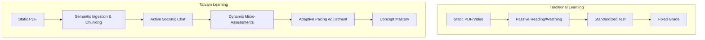

# Project Overview

**Document Purpose:** To define the core philosophy, vision, mission, and foundational principles driving the Tatvam platform.
**Scope:** Covers the educational crisis, product philosophy, target audience, and expected impact.
**Audience:** Investors, Product Managers, Engineers, and Design Teams.
**Revision Information:** v2.0 - Finalized Enterprise Vision

---

## 1. Introduction

Tatvam is an AI-first adaptive learning companion. Unlike traditional Learning Management Systems (LMS) that simply digitize analog classroom processes, Tatvam acts as an intelligent layer over educational content. It transforms static documents into dynamic, semantic knowledge graphs and provides students with an infinitely patient, hyper-personalized AI Mentor.

---

## 2. The Educational Crisis

### The 2 Sigma Problem
In 1984, educational psychologist Benjamin Bloom identified the "2 Sigma Problem": average students tutored one-to-one performed two standard deviations better than students taught in a conventional classroom environment. However, providing one-to-one human tutoring to every student is economically unscalable.

### Standardized Pacing
Modern mass education operates on an industrial model. Classrooms move at the speed of the average student. This leads to two critical failures:
1. **Advanced learners** become disengaged and bored.
2. **Struggling learners** fall behind, compounding their knowledge gaps until recovery becomes impossible.

### Passive Consumption
Existing EdTech platforms (e.g., Coursera, Udemy) rely heavily on passive consumption—watching videos or reading PDFs. This fosters an "illusion of competence." True mastery requires active recall, where the brain is forced to retrieve information.

### The Language Barrier
Highly complex technical subjects (Computer Science, advanced Mathematics) are often gatekept by English proficiency. ESL (English as a Second Language) learners face a double cognitive load: translating the language *and* decoding the concept.

---

## 3. Why Tatvam Exists

Tatvam exists to dissolve these barriers using deterministic, context-aware Artificial Intelligence. By integrating generative AI directly into the learning loop, Tatvam scales the one-to-one tutoring experience to infinity, democratizing elite educational paradigms.

### Core Philosophy
1. **Understanding > Memorization:** Tatvam refuses to simply give answers. It forces students to demonstrate application.
2. **Socratic Learning:** The AI Mentor uses guided questions, analogies, and hints to lead the student to their own epiphanies.
3. **Adaptive Friction:** The system dynamically adjusts the difficulty and pacing of instruction based on real-time mastery tracking.

---

## 4. Vision & Mission

**Vision**
To provide every learner on Earth with a deeply personalized, infinitely patient, and hyper-intelligent AI tutor that speaks their language and adapts to their unique cognitive fingerprint.

**Mission**
To build the most sophisticated, accessible, and adaptive learning engine that bridges the gap between passive consumption and active mastery, empowering learners to conquer complex concepts regardless of their background or learning disabilities.

---

## 5. Differentiating Tatvam

| Metric | Traditional Platforms | Tatvam AI |
| :--- | :--- | :--- |
| **Content** | Static & Pre-recorded | Dynamically generated based on user context |
| **Pacing** | Fixed for all students | Hyper-adaptive per user |
| **Language**| Hardcoded translations | Native real-time LLM generation |
| **Assessment**| High-stakes exams | Continuous low-stakes active recall |

---

## 6. Goals & Success Metrics

**Goals**
- Reduce the time required to master complex STEM concepts by 40%.
- Eliminate language barriers in technical education.
- Provide a completely private, localized learning ecosystem.

**Primary Success Metrics**
- **Engagement Time:** Average session length per user.
- **Completion Rate:** Percentage of uploaded documents actively queried or quizzed.
- **Mastery Velocity:** The rate at which semantic concepts move from "Unseen" to "Mastered".
- **AI Mentor Interactions:** Number of Socratic exchanges per session.

---

## 7. Target Audience

1. **University & K-12 Students:** Attempting to parse dense syllabi and technical material.
2. **Self-Taught Professionals:** Upskilling through software documentation or engineering textbooks.
3. **ESL & Vernacular Learners:** Requiring Socratic instruction in Hindi, Gujarati, Spanish, etc.
4. **Neurodivergent Learners:** Benefiting from highly structured, distraction-free, and pacing-controlled environments.

---

## 8. Expected Impact & Future Vision

Tatvam is designed to fundamentally alter how knowledge is acquired. In the short term, it serves as a highly advanced study companion. In the long term, Tatvam aims to become the foundational layer for personalized education, eventually mapping out a global "Learning DNA" schema that predicts the absolute optimal pedagogical strategy for any human brain.
