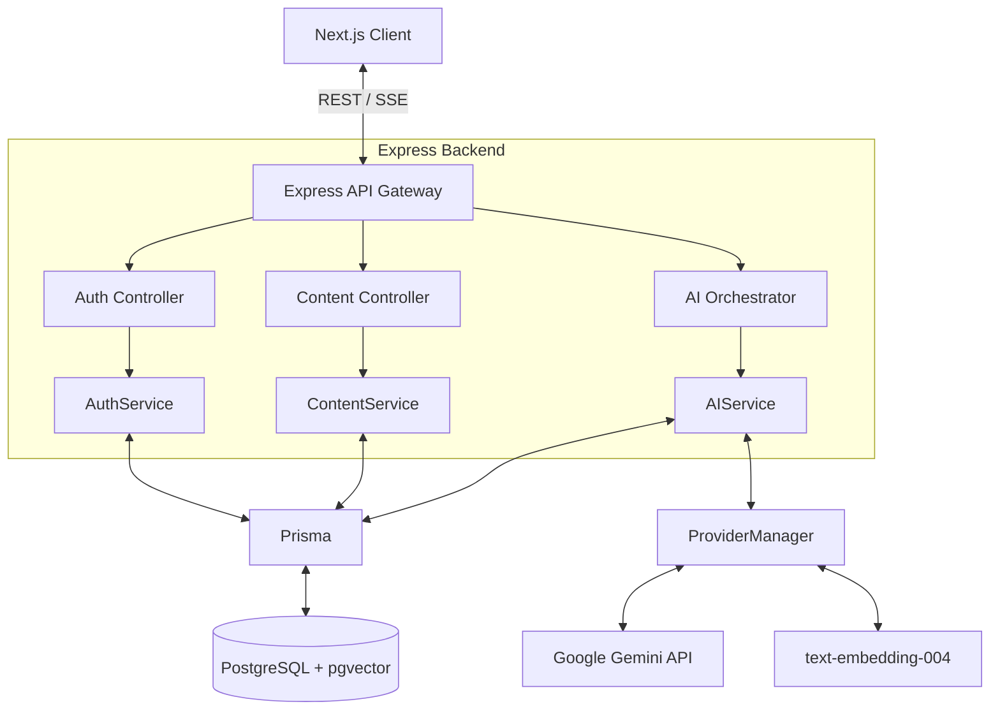
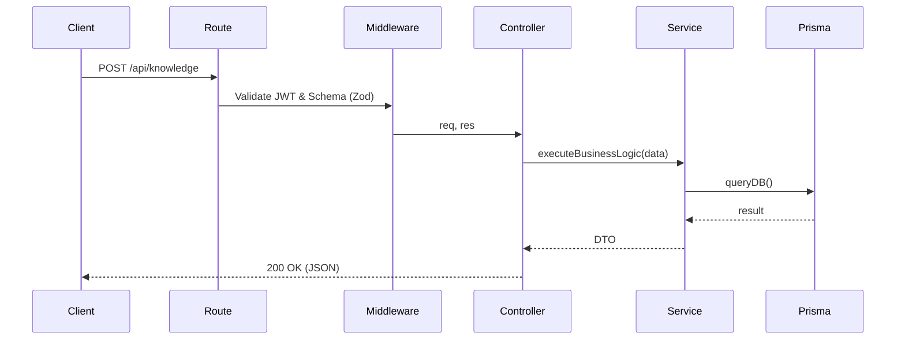

# System Architecture

**Document Purpose:** To detail the technical infrastructure, data flow, and orchestration logic of the Tatvam platform.
**Scope:** Covers Frontend, Backend, AI Layer, Database, and Deployment architecture.
**Audience:** Software Engineers, DevOps, System Architects.
**Revision Information:** v2.0 - Finalized Enterprise Architecture
**Related Documents:** `07_Development_Rules.md`

---

## 1. High-Level Architecture

Tatvam employs a modern, decoupled Client-Server architecture. The frontend is an SSR-capable Next.js application, communicating via REST and Server-Sent Events (SSE) with a monolithic Node.js/Express backend. Data is persisted in a PostgreSQL database managed by Prisma ORM, utilizing `pgvector` for semantic search.



---

## 2. Frontend Architecture (Next.js)

### Core Technologies
- **Framework:** Next.js 14 (App Router)
- **State Management:** Zustand (Global State) + React Query (Server State)
- **Styling:** Tailwind CSS

### Architecture Principles
- **Client-Side Rendering (CSR) Dominance:** Because Tatvam is a highly interactive dashboard application behind an auth wall, most components are strictly `"use client"`. SSR is utilized purely for static marketing or initial shell rendering.
- **Store Hydration:** Zustand stores (`useAuthStore`, `useEngineStore`) are hydrated via local storage and synchronized with React Query mutations.
- **Provider Injection:** Global utilities (e.g., `GoogleTranslate`, `QueryProvider`) are injected at the root `layout.tsx`.

---

## 3. Backend Architecture (Express + Prisma)

### Core Technologies
- **Runtime:** Node.js
- **Framework:** Express.js
- **ORM:** Prisma
- **Validation:** Zod

### Folder Structure & Layered Architecture
The backend follows a strict Controller-Service-Repository pattern.

```text
backend/src/
├── api/          # Controllers (HTTP parsing, Response formatting)
├── core/         # Services (Business logic, Prisma orchestration)
├── config/       # Environment setup
├── middleware/   # Auth, Error handling, Logging
└── utils/        # Generic helpers
```

### Request Lifecycle


---

## 4. Authentication Architecture

Tatvam uses stateless JWT authentication.

1. **Login:** User submits credentials. Backend validates bcrypt hash.
2. **Token Generation:** Backend issues short-lived `accessToken` (15m) and long-lived `refreshToken` (7d).
3. **Persistence:** Tokens are returned to the client and stored in memory/Zustand (or secure cookies).
4. **Interception:** The frontend `apiClient` Axios interceptor attaches the `Bearer` token to every request.
5. **Validation:** Backend `authenticate` middleware verifies the token signature using `jsonwebtoken`.

---

## 5. AI Architecture & Orchestration

The AI layer is the most complex segment of Tatvam. It is designed to be provider-agnostic, context-heavy, and strictly constrained.

### Provider Manager
Tatvam uses a generic `ProviderManager` interface. Currently, `Google Gemini` is fully implemented. The architecture supports immediate integration of OpenAI GPT or xAI Grok by creating a new adapter class that satisfies the interface.

### The RAG Pipeline (Retrieval-Augmented Generation)
1. **Ingestion:** Uploaded PDFs are parsed by `pdf-parse`.
2. **Chunking:** Text is split using recursive character chunking with a defined overlap (e.g., 1000 tokens, 200 overlap).
3. **Embedding:** Chunks are passed to `text-embedding-004` to generate 768-dimensional vectors.
4. **Storage:** Vectors are stored in PostgreSQL using the `pgvector` extension.
5. **Retrieval:** User queries are embedded, and an L2 Distance or Cosine Similarity search retrieves the top-K most relevant chunks.

### AI Prompting Strategy
Tatvam never relies on a model's baseline personality. Every request is injected with a massive System Prompt that enforces:
- **Pedagogical Rules:** "You are a Socratic tutor. Do not give the direct answer."
- **Language Constraints:** "You MUST RESPOND ENTIRELY IN [User Preferred Language]."
- **Context Injection:** "Use ONLY the following semantic chunks to answer the question."

### Streaming (Server-Sent Events)
To provide real-time feedback, the `chatStream` service utilizes Express response streaming (`res.write()`). The Next.js frontend reads this stream incrementally, creating a typing effect identical to ChatGPT.

---

## 6. Multilingual Pipeline Architecture

Tatvam achieves native translation without bulky i18n JSON maps.

1. **State:** User selects "Gujarati" in settings. Saved to DB and Zustand.
2. **Header Injection:** Axios interceptor attaches `X-Preferred-Language: Gujarati` to all API requests.
3. **AI Translation:** The backend extracts the header and injects it into the Gemini System Prompt. Gemini streams the response natively in Gujarati.
4. **UI Translation (DOM Manipulation):** A global `GoogleTranslate` component triggers the hidden `googtrans` cookie and iframe, instantly translating hardcoded React labels and toasts without a page reload.

---

## 7. Scalability & Error Handling

### Scalability
- **Stateless Backend:** Since sessions are JWT-based and AI orchestration is stateless, the Express API can be horizontally scaled infinitely behind a load balancer.
- **Connection Pooling:** Prisma utilizes connection pooling to prevent PostgreSQL connection starvation during high concurrent loads.

### Error Handling
- **Zod Middleware:** Prevents malformed requests from ever reaching the service layer.
- **Global Error Handler:** An Express middleware catches all unhandled exceptions, logs them, and formats a standardized JSON response (`{ success: false, error: { message: "..." } }`), preventing stack trace leakage in production.
