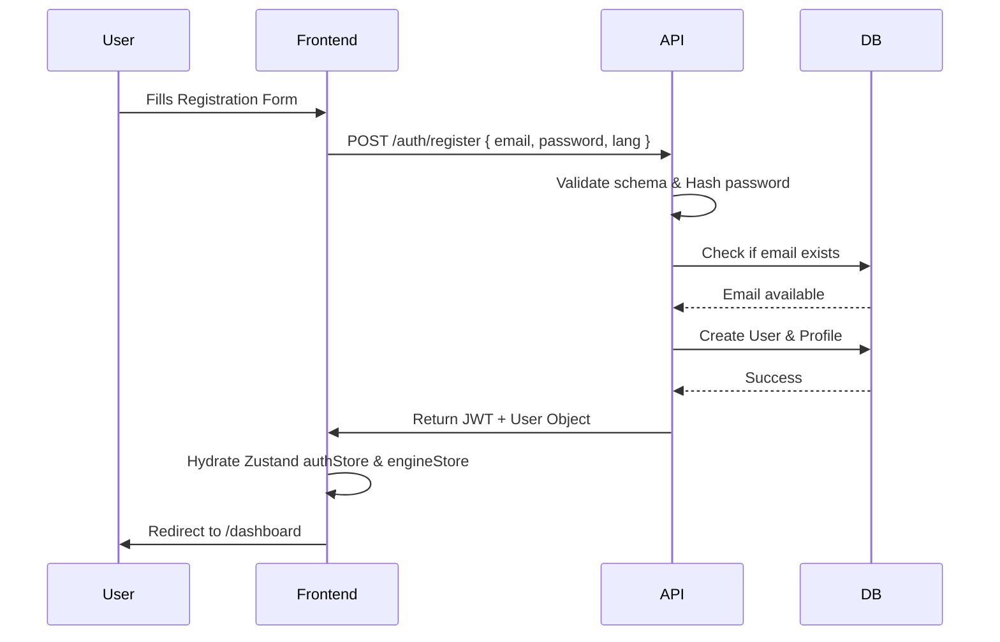
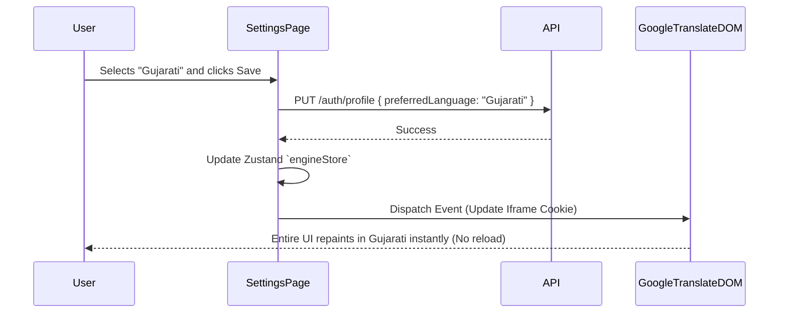
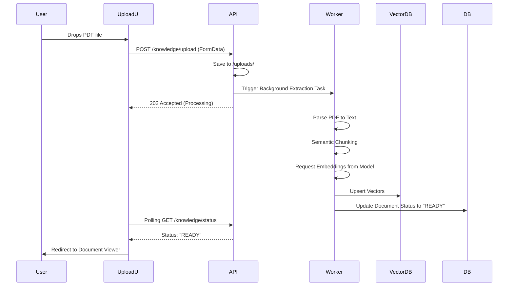
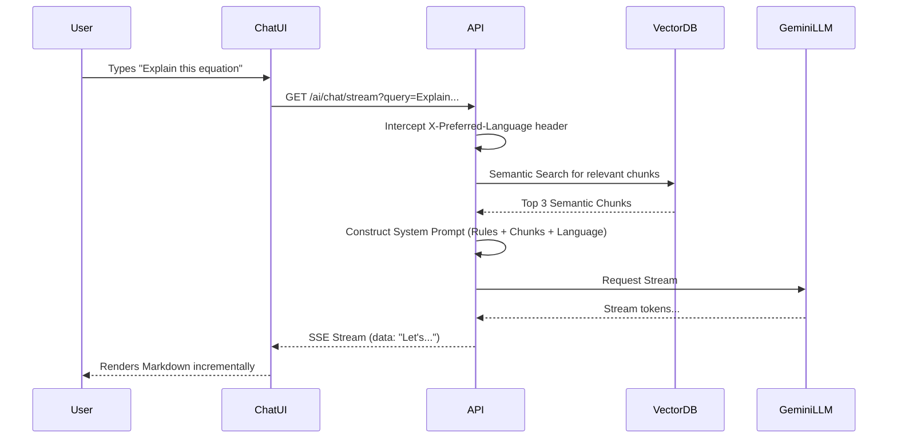
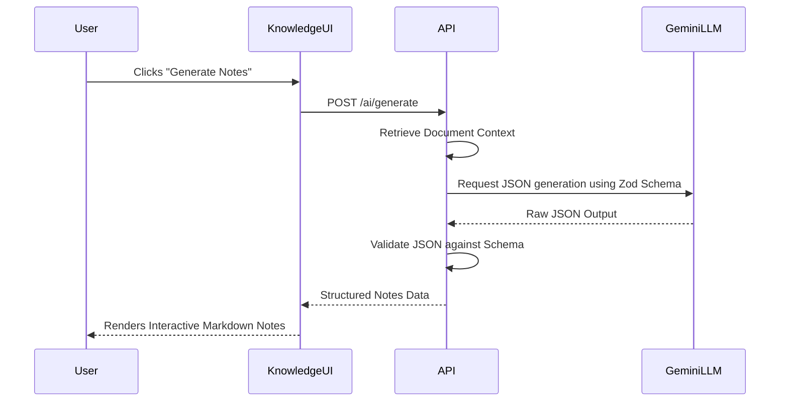
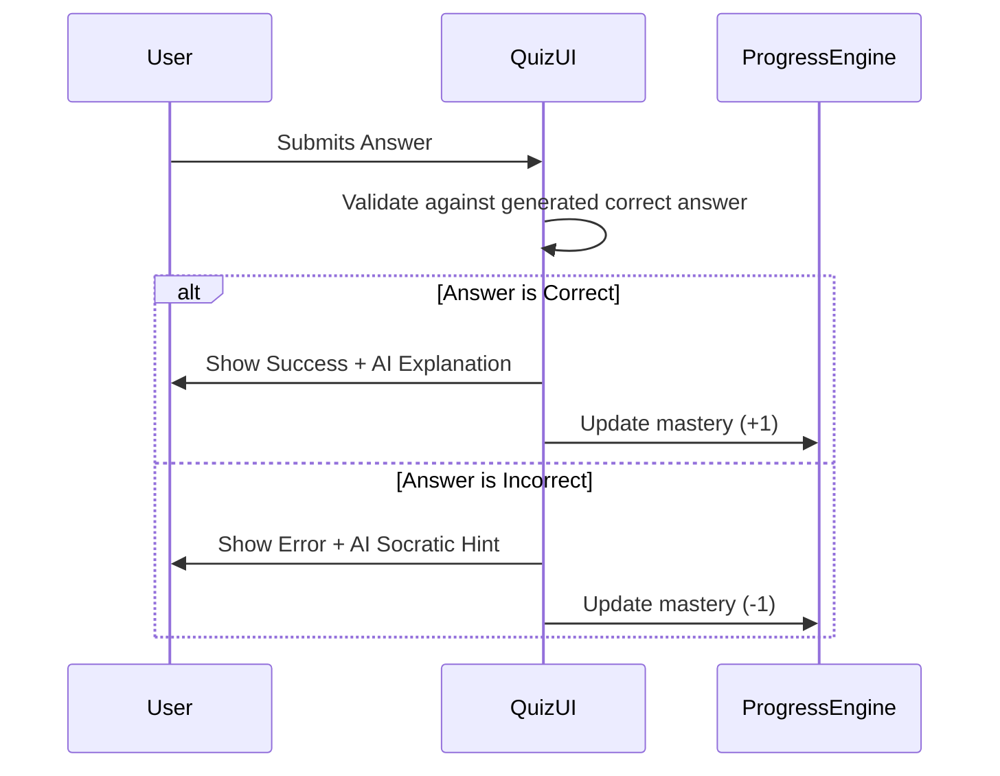

# User Flows

**Document Purpose:** To visualize and document the critical user journeys through the Tatvam platform.
**Scope:** Covers Onboarding, Knowledge Ingestion, AI Interaction, and Settings workflows.
**Audience:** Product Managers, UI/UX Designers, QA Engineers.
**Revision Information:** v2.0 - Finalized Enterprise Workflows
**Related Documents:** `05_Feature_Specification.md`

---

## 1. Registration & Onboarding Flow

## 2. Language Selection Flow

## 3. Document Upload & Ingestion Flow

## 4. AI Mentor (Socratic Chat) Flow

## 5. Resource Generation (Smart Notes) Flow

## 6. Assessment (Quiz) Flow

